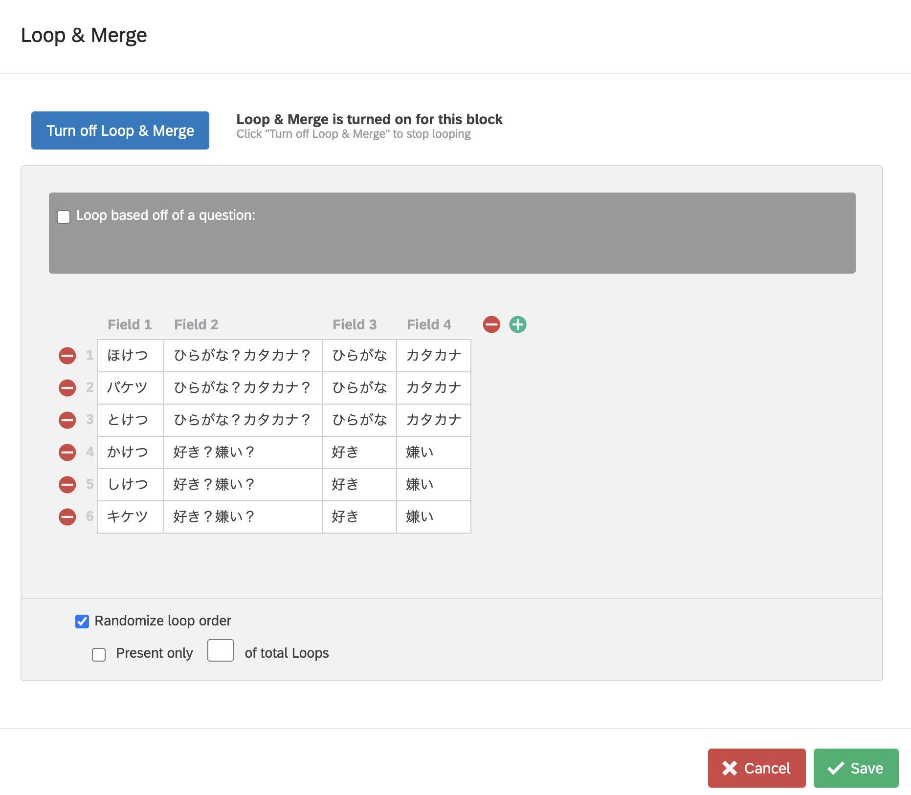

新型コロナウィルス感染症の感染拡大以前から，研究データの収集をオンライン上で行うことが徐々に増えてきています。

さて，その場合，環境を統一することは難しいのですが，特に問題なのは，どのように実験・調査に参加させるかという問題があります。とはいっても，人材募集の方法の話ではなくて，どうやって実験・調査を受けさせるかという問題です。研究をオフラインで行うなら，調査の場合は調査票になりますし，実験の場合は実験の内容次第で色々な計測機器を使うでしょう（紙に書かせるだけの実験ももちろんあります）。オンラインの場合は，参加者自身が使える方法でなければならないわけで，そうなると使える選択肢はほぼ web ブラウザ一択になります（ブラウザであれば，PC だけでなく，スマホやタブレットなどほぼ全ての情報端末にデフォルトでインストールされていて，追加のインストールが必要ないためです）。

ブラウザベースの調査・実験を行うためには，色々なツールを使って環境を作って行くことになります。で，そのツールの候補は，まあいろいろあるわけです（[この辺](https://note.com/yoshi_majima/n/nc72e2a4038da) 参考にしてください）が，まあ，実際どれ使ったら良いか迷いますよね。お金と，スキルと，かけることができる時間と相談して決めるしかありません。あと，できるならばなるべくツールは少なく済ませたい（覚える必要があるものの数を減らしたい）ですよね。

しかし，困ったことに，それぞれ一長一短があって，例えば，画面（刺激）の呈示タイミングをきちんとコントロールした上で，反応時間もキチンとミリ秒単位で測りたい，という場合は，実験に特化したツールを使った方が良いですし（高くてもよければ，Inquisit Web とか，gorilla.sc とか，ホスティングはお金かかっても良いけど，ツールは無料にして安くあげようとするなら，{jsPsych, lab.js, PsychoPy}+Pavlovia とか），そこまでガチガチな制御はいらないけどループ制御や，回答に応じた条件分岐はしたいという場合は，サーヴェイ用に作り込まれたツールの方がいいかもしれません（実験特化型よりは取っつきやすいですし）。

今日はそのうち，サーヴェイ用のツールの雄，[Qualtrics](https://www.qualtrics.com/)のお話。

とはいっても，Qualtrics のマニュアルを書こうとか大それた話ではなくて，簡単なループ制御とか，マウスクリックじゃなくてキーボード反応だけでどんどん進んでいくようにできないか，というちょっとした Tips を紹介します。

### Qualtrics でループ制御

心理学実験だと，同じ手続きを刺激を変えて繰り返すというおなじみの方法がありますが，Qualtrics で，それをやりたい場合は，1試行をブロック化して，ブロックにループの制御を付け加えるということをします。例として，処理水準実験っぽいものを作ってみたいと思います。

まずは，いつものように新しいプロジェクトを作って，最初の教示とかインフォームドコンセントフォームとかを適当に作ってください。次に，単語の学習フェーズ用のブロックを Add Block で追加します。名前を付けたら，Block Options をクリックして，Loop & Merge を選びます。


デフォルトでは，ループが有効になっていないので，


をクリックして，有効にします。ループの設定は，スプレッドシート形式になっているので，直接入力しても良いですし，Excel とかの表をコピー・ペーストすることもできます。



上の例だと，1列目 (Field1) に表示する単語，2列目は，水準操作をするための質問文，3, 4 列目は，画面に表示する2つの選択肢のラベルのためのテキストです。


ループの設定をしたら，ブロックの中身を書いていきます。注視点用の Descriptive Text，注視点の表示時間をコントロールする Timing，刺激を呈示して反応を求める Multiple Choice を順番に配置します（Multiple choice は2択なので Choices = 2 にしておく）。画面の例では，Timing と Multiple Choice の間に何もありませんが，この2つの間には，Page Break を挿入してください。


さて，ループ変数から値を読み込んで表示するには，Piped Text を使います。上の例だと，Q4 が刺激語の呈示の  Question になるので，Q4 の質問文をクリックして，Rich Text Editor を起動して， {A} という形のボタンをクリックします。


Piped Text とは，色々な変数から値を持ってきて表示するために使う変数のことです。Loop & Merge の中から挿入したいフィールドを選んで，配置していきます。なお，Loop & Merge の場合は，${lm://Field/??} (?? に Loop & Merge の Field 番号が入る) というものが挿入されますので，直接，これを入力しても問題ありません。まずは，質問文 (Field2) と単語 (Field1) を Multiple Choice のテキスト欄に設定しましょう。


次に，選択肢の方も Piped Text にします。Click to write Choice ? という値がデフォルトで入っていますが，その横の下向き矢印をクリックすると，メニューが選べますので，Insert Piped Text => Loop & Merge で，Field 3 と Field 4 にそれぞれ割り付けます。


できあがると下のような感じ。ここでは，左側が Field3，右側が Field4 になるようにするため，

`Choice1 に Field3，Choice 2 に Field 4 を入れ，ボタンの表示を Column，列数 2 `

にしています。


刺激呈示のうしろに，Timing (Q5) Question も配置しています（が，なくてもとりあえずは問題ありません）。

### キーボード反応で進むようにする

次に，マウスではなく，キーボード反応で次に進むようにしますが，その前に

- 注視点 (Q2) のすぐあとの，Timing Question (Q3) は 1 秒で自動的に次に進むようにしておきます。

  `Timing Question の Auto-advance after の値を 1 にすればOK`

- Timing Question (Q3) と刺激語の呈示 (Q4) の間に，Page Break を入れておきます


次に行うのは，注視点を表示している間，次へボタンを不用意にクリックされないよう，**次へボタンを隠す**，という設定です。これは，設定項目にはないので，javascript コードを追加して，設定します。

注視点 (Q2) のところにある歯車型のボタンをクリックして，そこから **Add JavaScript** を選びます。


そうすると，script editor が起動しますので，最初の **Qualtrics.SurveyEngine.addOnload** のところを，以下のように書き換えます。

``` js
Qualtrics.SurveyEngine.addOnload(function()
{
	/*Place your JavaScript here to run when the page loads*/
	
	/* ボタンを隠す */
	this.hidePreviousButton();
	this.hideNextButton();

});
```

書き換えます，というか２行追加します。これで，次へ進むボタンが表示されなくなるので，参加者は１秒待って自動で画面が切り替わるのを待つしかなくなります。

次に，刺激語の方も同じように javascript を書いて，今度は正しいキーボード反応があったときのみ次へ進むようにしてみます。同じように **Add Javascript** を選んで，以下のコードを入れましょう。

``` js
Qualtrics.SurveyEngine.addOnload(function()
{
	/*Place your JavaScript here to run when the page loads*/
	
	/* 進む・戻るボタンを隠す */
	this.hidePreviousButton();
	this.hideNextButton();

	var that = this;

	
	/* Keydown イベントの監視 */
	Event.observe(document, 'keydown', function keydownCallback(e) {
		var choiceID = null; 
		
		switch (e.keyCode) {
			case 70: // 'F' が押された
				choiceID = 1; // 選択結果 = 1
				break;
			case 74: // 'J' が押された
				choiceID = 2; // 選択結果 = 2
				break;
		}
		
		if (choiceID) {
			Event.stopObserving(document, 'keydown', keydownCallback);
			that.setChoiceValue(choiceID, true);
			$('NextButton').click();
		}
	});
	

});
```

重要なポイントは以下です。

- Event.observe でキー押しを監視しするようにする
- キー押しで F が押された (keycode の値で判定します) 場合と J が押された場合は，choiceID をセットしますが，それ以外のキーの場合はセットしません (switch 構文)
  - ちなみに，F キーは左側のボタン (Loop & Merge の Field3 側)，J キーは右側のボタン (FIeld4 側) が押されたイベントに相当するように設定
- choiceID の値がセットされたら，
  - イベント監視を中止し (Event.stopObserving)
  - この Multiple Choice Question の選択結果を choiceID に設定 (1 = F, 2 = J)し
  - スクリプトから次へボタンをクリック ($('Next Button').click())

実際には，ボタンクリックは無いわけですが，スクリプトからボタンクリックに相当するコマンドを送ることで，次に進むようにしています。

これで，基本的な部分の設定はおしまい。

あとは，適当にフィラー課題とか，最後の再生なり再認課題を入れればできあがり，です。


再認課題もキー押しでさせたければ，↑と同じ要領で可能です。

さて，今回は，反応時間をとっていません。Timing で，ページが表示されてから次へ進むがクリックされるまでの時間は取得できるのですが，正確な値ではありませんので，反応時間の計測は別途スクリプトを書く必要があります。

これについては，またの機会に。

> 時間を測定するところまでは出来ているのですが，上手い形で出力する方法が見つかりません。一つ行けそうな方法は見つかっていますが，まだ完成してないのです〜